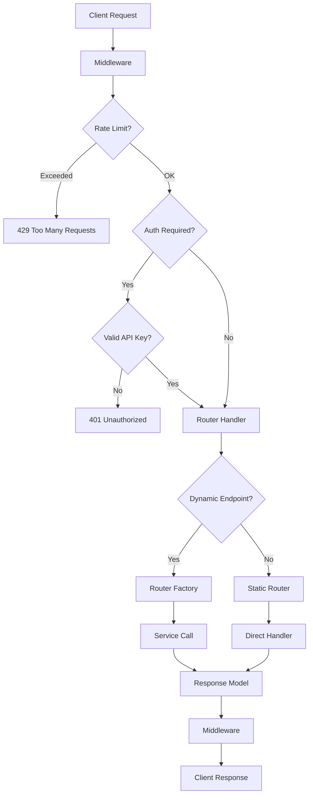

# Project Structure

Understand the Apiary codebase architecture and organization.

## Overview

Apiary follows a modular architecture with clear separation of concerns:

- **`config/`** - Configuration management and validation
- **`core/`** - Reusable utilities and base functionality
- **`models/`** - Data models and schemas
- **`routers/`** - HTTP endpoint handlers
- **`services/`** - Business logic implementations
- **`static/`** & **`templates/`** - Web assets
- **`tests/`** - Test suite

---

## Directory Layout

```text
apiary/
├── app.py                      # FastAPI application factory
├── cli.py                      # Command-line interface
├── __version__.py              # Version information
│
├── config/                     # Configuration Management
│   ├── __init__.py
│   ├── settings.py             # Settings model (Pydantic)
│   ├── endpoint_config.py      # Endpoint configuration model
│   ├── settings_template.json  # Default settings template
│   ├── endpoints_template.json # Default endpoints template
│   ├── settings.json           # Your settings (gitignored)
│   └── endpoints.json          # Your endpoints (gitignored)
│
├── core/                       # Core Framework
│   ├── auth/                   # Authentication & Authorization
│   │   ├── authentication.py   # API key verification
│   │   └── authorization.py    # Dependency injection for auth
│   ├── services/               # Service Base Classes
│   │   └── base.py             # BaseService interface
│   ├── api_key_manager.py      # Key loading & hot-reloading
│   ├── api_key_validator.py    # Configuration validation
│   ├── cache.py                # Response caching utilities
│   ├── dependencies.py         # FastAPI dependencies
│   ├── exceptions.py           # Custom exception classes
│   ├── logging_config.py       # Logging configuration
│   ├── metrics.py              # Metrics collection
│   ├── middleware.py           # Request/response middleware
│   ├── rate_limiter.py         # Rate limiting logic
│   ├── request_validation.py   # Request validation
│   └── router_factory.py       # Dynamic router generation
│
├── models/                     # Data Models
│   ├── requests.py             # Request models (Pydantic)
│   └── responses.py            # Response models (Pydantic)
│
├── routers/                    # Built-in Routers
│   ├── auth.py                 # /auth endpoints
│   ├── endpoints.py            # /endpoints discovery
│   ├── health.py               # /health checks
│   ├── home.py                 # / landing page
│   └── metrics.py              # /metrics endpoint
│
├── services/                   # Built-in Services
│   ├── crypto.py               # Crypto helper functions
│   ├── crypto_service.py       # Crypto price service
│   └── hello_service.py        # Hello world demo service
│
├── routers_custom/             # Custom Routers (gitignored)
│   └── __init__.py             # Your custom routers here
│
├── services_custom/            # Custom Services (gitignored)
│   └── __init__.py             # Your custom services here
│
├── static/                     # Static Assets
│   ├── css/                    # Stylesheets
│   │   ├── docs.css
│   │   └── theme.css
│   └── img/                    # Images & icons
│
├── templates/                  # Jinja2 Templates
│   ├── home/                   # Landing page templates
│   └── shared/                 # Shared layouts
│
├── tests/                      # Test Suite
│   ├── conftest.py             # Pytest configuration
│   ├── unit/                   # Unit tests
│   └── integration/            # Integration tests
│
├── docs/                       # Documentation (MkDocs)
│   ├── getting-started/
│   ├── guide/
│   ├── deployment/
│   ├── reference/
│   └── about/
│
├── pyproject.toml              # Project metadata & dependencies
├── uv.lock                     # Dependency lock file
├── pytest.ini                  # Pytest configuration
├── mkdocs.yml                  # Documentation configuration
└── README.md                   # Project overview
```

!!! info "Configuration Files"
    Files like `config/settings.json`, `config/endpoints.json`, `services_custom/`, and `routers_custom/` are gitignored. Run `uv run apiary init` to create them from templates.

---

## Core Components

### Application Entry Point

=== "app.py"

    **Main application factory** that creates and configures the FastAPI application.

    **Key responsibilities:**

    - Initialize FastAPI app with configuration
    - Load settings and endpoint configurations
    - Register routers (built-in and custom)
    - Configure middleware and exception handlers
    - Set up CORS, rate limiting, and logging

    **Usage:**

    ```python
    from app import api  # Import the FastAPI app
    ```

    ```bash
    # Run with uvicorn directly
    uvicorn app:api --host 0.0.0.0 --port 8000

    # Run with CLI
    uv run apiary serve
    ```

=== "cli.py"

    **Command-line interface** for maintenance and development tasks.

    **Available commands:**

    - `serve` - Start the development server
    - `init` - Initialize configuration files
    - `validate-config` - Validate API keys
    - `test` - Test configuration and imports
    - `backup` - Backup configuration
    - `clean` - Clean generated files

    See [CLI Reference](cli.md) for full documentation.

### Configuration Layer

=== "config/settings.py"

    Pydantic Settings model for type-safe configuration.

    **Features:**

    - Environment variable support
    - JSON file loading
    - Type validation
    - Default values

    [:octicons-arrow-right-24: Settings Reference](config.md#application-settings)

=== "config/endpoint_config.py"

    Endpoint configuration model with validation.

    **Features:**

    - Pydantic validation
    - Duplicate detection
    - Path validation
    - HTTP method enum

    [:octicons-arrow-right-24: Endpoint Config Reference](config.md#endpoint-configuration)

=== "Template Files"

    Default configuration templates:

    - `settings_template.json` - Default application settings
    - `endpoints_template.json` - Example endpoint configurations

    These are copied to `settings.json` and `endpoints.json` by `uv run apiary init`.

### Core Framework

=== "Authentication"

    **`core/auth/`** - Authentication and authorization system

    **Files:**

    - `authentication.py` - API key verification logic
    - `authorization.py` - FastAPI dependencies for protecting endpoints

    [:octicons-arrow-right-24: Authentication Reference](core.md#authentication)

=== "Services"

    **`core/services/base.py`** - Abstract base class for all services

    **Features:**

    - HTTP client management
    - Async support
    - Lifecycle management (cleanup)

    [:octicons-arrow-right-24: Base Service Reference](core.md#services)

=== "API Key Management"

    **`core/api_key_manager.py`** - API key loading and hot-reloading

    **Features:**

    - Load keys from strings or files
    - Automatic file change detection
    - In-memory caching
    - Thread-safe operations

    [:octicons-arrow-right-24: API Key Manager Reference](core.md#api-key-management)

=== "Validation"

    **`core/api_key_validator.py`** - Configuration validation

    **Validates:**

    - API key file existence
    - Key format and strength
    - Configuration consistency

    [:octicons-arrow-right-24: Validator Reference](core.md#api-key-validator)

=== "Middleware & Utilities"

    **Core utilities:**

    - `cache.py` - Response caching headers
    - `dependencies.py` - Dependency injection
    - `exceptions.py` - Custom exceptions
    - `logging_config.py` - Structured logging
    - `metrics.py` - Application metrics
    - `middleware.py` - Request/response processing
    - `rate_limiter.py` - Rate limiting logic
    - `request_validation.py` - Request validation
    - `router_factory.py` - Dynamic router creation

    [:octicons-arrow-right-24: Core Modules Reference](core.md)

### Routers & Services

=== "Built-in Routers"

    **`routers/`** - HTTP endpoint handlers

    | Router | Path | Purpose |
    |--------|------|---------|
    | `home.py` | `/` | Landing page |
    | `health.py` | `/health` | Health checks |
    | `metrics.py` | `/metrics` | Application metrics |
    | `auth.py` | `/auth` | Authentication info |
    | `endpoints.py` | `/endpoints` | Endpoint discovery |

    Routers can be enabled/disabled in `settings.json`:

    ```json
    {
      "enabled_routers": ["health", "metrics", "auth", "endpoints"]
    }
    ```

=== "Built-in Services"

    **`services/`** - Business logic implementations

    | Service | Purpose | Reference |
    |---------|---------|-----------|
    | `hello_service.py` | Demo service | [HelloService](services.md#hello-service) |
    | `crypto_service.py` | Crypto prices | [CryptoService](services.md#crypto-service) |

    All services inherit from `BaseService`:

    ```python
    from core.services.base import BaseService

    class MyService(BaseService):
        async def call(self, parameters=None):
            return {"result": "data"}
    ```

=== "Custom Extensions"

    **Update-safe directories for your code:**

    **`services_custom/`** - Your custom services (gitignored)

    - Add your service files here
    - Register in `services_custom/__init__.py`

    **`routers_custom/`** - Your custom routers (gitignored)

    - Add your router files here
    - Each must export a `router` variable
    - Enable in `settings.json` → `enabled_routers`

    Created by `uv run apiary init --custom-dirs`

    [:octicons-arrow-right-24: Creating Services Guide](../guide/creating-services.md)

### Data Models

=== "models/responses.py"

    Response models using Pydantic.

    **Base classes:**

    - `BaseResponse` - Includes automatic timestamp

    [:octicons-arrow-right-24: Models Reference](models.md)

=== "models/requests.py"

    Request models and query parameters.

    [:octicons-arrow-right-24: Models Reference](models.md)

---

## Request Flow

Understanding how a request flows through Apiary:



1. **Middleware** - Logs request, adds request ID, applies CORS
2. **Rate Limiting** - Checks request rate (if enabled)
3. **Authentication** - Validates API key (if required)
4. **Routing** - Matches request to handler (static or dynamic)
5. **Service** - Executes business logic
6. **Response** - Returns validated Pydantic model
7. **Middleware** - Adds response headers, logs response

---

## Adding New Components

### Adding a Service

1. **Create service file** in `services_custom/`:

    ```python
    # services_custom/weather_service.py
    from core.services.base import BaseService

    class WeatherService(BaseService):
        async def call(self, parameters=None):
            # Your logic here
            return {"temperature": 72}
    ```

2. **Register in `services_custom/__init__.py`**:

    ```python
    from .weather_service import WeatherService

    __all__ = ["WeatherService"]
    ```

3. **Add to `config/endpoints.json`**:

    ```json
    {
      "path": "/api/weather",
      "method": "GET",
      "service": "weather",
      "enabled": true,
      "requires_auth": false
    }
    ```

[:octicons-arrow-right-24: Creating Services Guide](../guide/creating-services.md)

### Adding a Router

1. **Create router file** in `routers_custom/`:

    ```python
    # routers_custom/custom.py
    from fastapi import APIRouter

    router = APIRouter()

    @router.get("/custom")
    async def custom_endpoint():
        return {"message": "Custom router"}
    ```

2. **Enable in `config/settings.json`**:

    ```json
    {
      "enabled_routers": ["health", "metrics", "custom"]
    }
    ```

[:octicons-arrow-right-24: Adding Endpoints Guide](../guide/adding-endpoints.md)

### Adding a Model

1. **Add to `models/responses.py` or `models/requests.py`**:

    ```python
    from models.responses import BaseResponse

    class WeatherResponse(BaseResponse):
        temperature: float
        humidity: float
        condition: str
    ```

2. **Use in router**:

    ```python
    @router.get("/weather", response_model=WeatherResponse)
    async def get_weather():
        return WeatherResponse(
            temperature=72.5,
            humidity=45.0,
            condition="sunny"
        )
    ```

---

## Configuration Files

### Tracked in Git

These files are part of the repository:

- `pyproject.toml` - Dependencies and project metadata
- `mkdocs.yml` - Documentation configuration
- `pytest.ini` - Test configuration
- `config/*_template.json` - Configuration templates
- All `.py` files in `config/`, `core/`, `models/`, `routers/`, `services/`

### Not Tracked (Gitignored)

These are created locally and not committed:

- `config/settings.json` - Your settings
- `config/endpoints.json` - Your endpoints
- `config/*_keys.txt` - Your API keys
- `services_custom/` - Your custom services
- `routers_custom/` - Your custom routers
- `backups/` - Configuration backups
- `site/` - Built documentation
- `__pycache__/`, `*.pyc` - Python cache files

This allows you to safely `git pull` updates without conflicts!

---

## Development Workflow

### Initial Setup

```bash
# Clone and install
git clone <repository>
cd apiary
uv sync

# Initialize configuration
uv run apiary init

# Edit configuration
edit config/settings.json
edit config/endpoints.json

# Validate and test
uv run apiary validate-config
uv run apiary test

# Start server
uv run apiary serve --reload
```

### Adding Features

```bash
# Create custom service
mkdir -p services_custom
edit services_custom/my_service.py

# Configure endpoint
edit config/endpoints.json

# Test changes
uv run apiary test

# Start with auto-reload
uv run apiary serve --reload
```

### Updating from Upstream

```bash
# Backup your config
uv run apiary backup --include-custom

# Pull updates
git pull origin main
uv sync

# Check for new config options
diff config/settings_template.json config/settings.json

# Test before deploying
uv run apiary test
```

---

## Next Steps

- [Quick Start Guide](../getting-started/quickstart.md) - Get started quickly
- [Configuration Guide](../getting-started/configuration.md) - Configure your instance
- [Adding Endpoints](../guide/adding-endpoints.md) - Create custom endpoints
- [Creating Services](../guide/creating-services.md) - Build service classes
- [CLI Reference](cli.md) - Command-line tools
